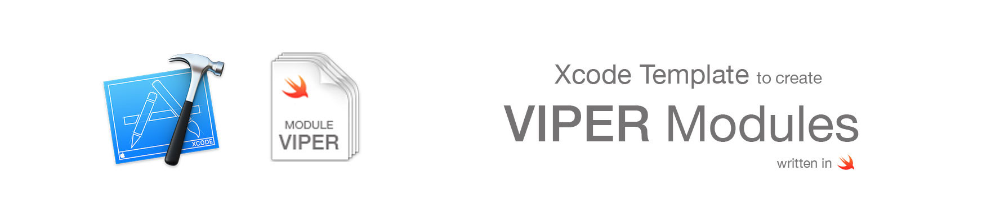
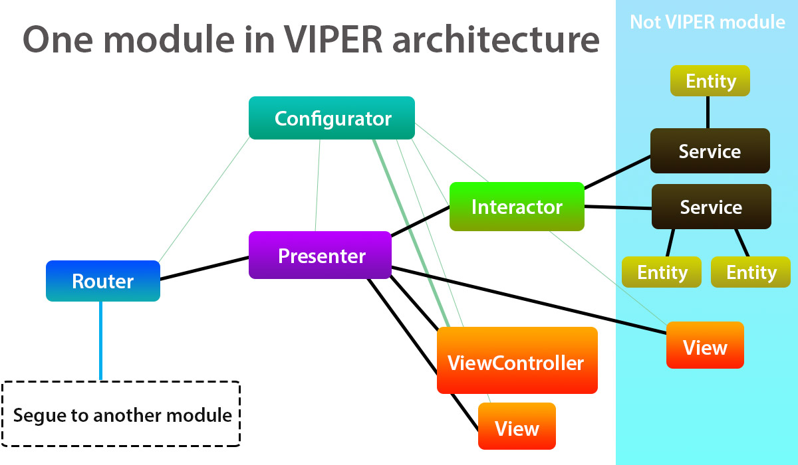

## How to install

### Using script (easy)
Only need execute this command in terminal:
```swift
sudo swift install.swift
```
### Manual
Go to Application folder, browse to the Xcode application icon. Right-click it and choose 'Show Package Contents'. Then browse to:
`Contents/Developer/Platforms/iPhoneOS.platform/Developer/Library/Xcode/Templates/Project Templates/iOS/Application` and add "Module VIPER.xctemplate" file. Now you can find your template in Xcode.

## VIPER diagram overview

## References
-[Разбор архитектуры VIPER на примере небольшого iOS приложения на Swift 4](https://habr.com/ru/post/358412/)

## Author

* Maxim Spiridonov[🐦](telegram @taijased)
